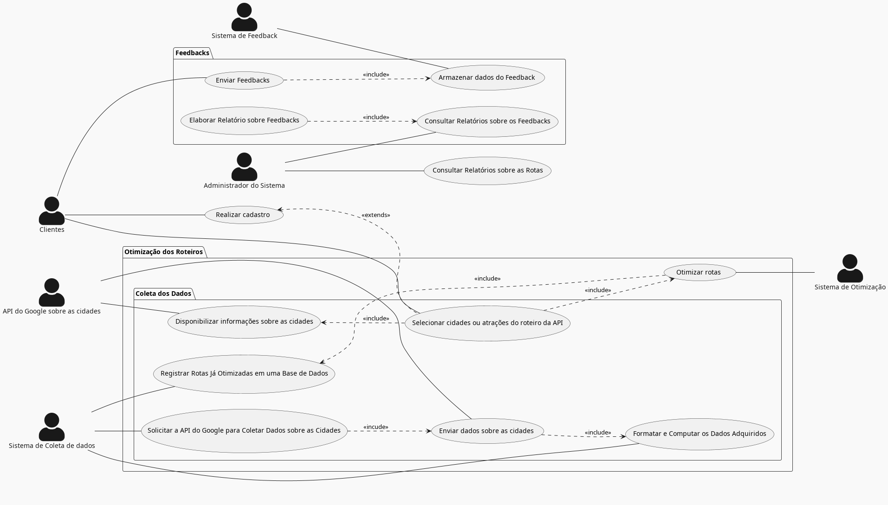
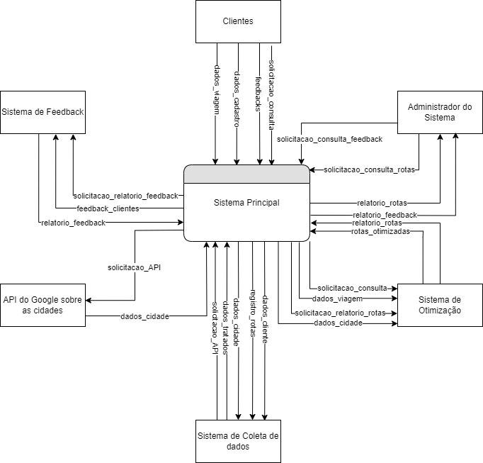
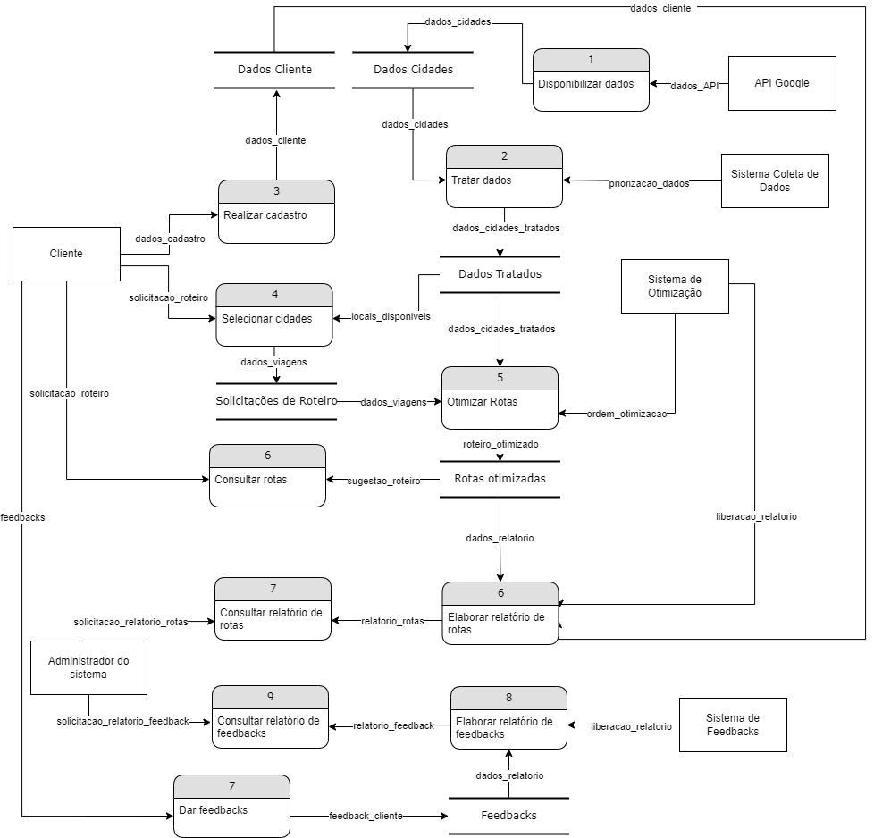
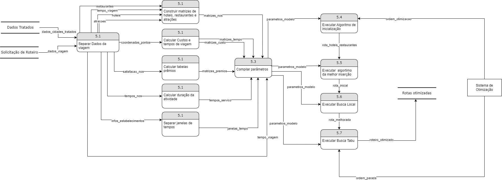
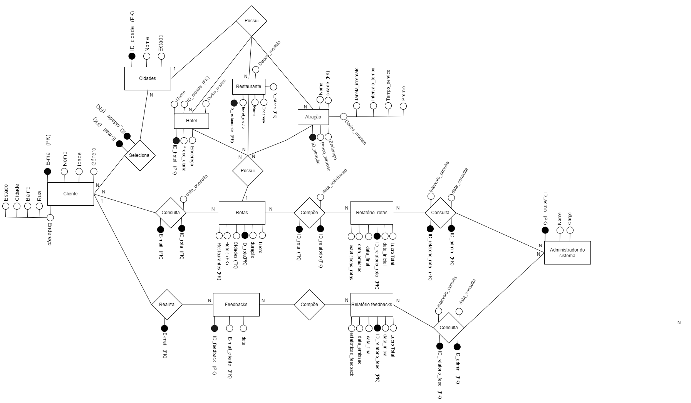

# Sistema de Informação para Otimização de Roteiros Turísticos por Metaheuristica

## Descrição do Projeto

O Sistema de Otimização de Roteiros Turísticos é uma solução inovadora desenvolvida para enfrentar os desafios específicos do planejamento de itinerários no setor do turismo. Com base em técnicas avançadas de Pesquisa Operacional e um sistema de informação gerencial integrado, o projeto visa criar roteiros altamente satisfatórios e eficientes, proporcionando experiências únicas e enriquecedoras aos viajantes.

## Motivação

A indústria do turismo desempenha um papel significativo na economia global, porém, enfrenta complexidades na criação de roteiros turísticos personalizados. Problemas como falta de otimização, informações descentralizadas e falta de uma visão holística das operações impactam a satisfação dos clientes e a reputação das empresas. Esse projeto surge como uma oportunidade de inovação para superar tais desafios e oferecer um sistema único e diferenciado no campo da logística turística.

## Funcionalidades Principais

- Cadastro de Novos Clientes: Permite que novos clientes se cadastrem fornecendo informações pessoais.
- Selecionar Cidades ou Atrações do Roteiro: Os clientes podem personalizar seus roteiros selecionando cidades ou atrações turísticas de interesse.
- Acesso à API do Google para Coletar Dados sobre as Cidades: O sistema coleta informações atualizadas e relevantes sobre as cidades e atrações.
- Formatar e Computar os Dados Adquiridos: Os dados coletados são formatados e processados para permitir a otimização das rotas.
- Otimizar Rotas: O sistema utiliza algoritmos de Pesquisa Operacional para otimizar as rotas turísticas com base nas preferências dos clientes e informações das cidades ou atrações.
- Elaborar Relatórios sobre Rotas: Gera relatórios detalhados sobre as rotas turísticas otimizadas para análise e tomada de decisões.
- Consultar Relatórios sobre as Rotas: Clientes e administradores podem consultar os relatórios sobre as rotas otimizadas.
- Armazenar Rotas Já Otimizadas em uma Base de Dados: As rotas turísticas otimizadas são armazenadas para consultas e referências futuras.
- Disponibilizar Informações sobre as Cidades: A API do Google disponibiliza informações detalhadas sobre cidades e atrações para auxiliar na seleção dos roteiros.
- Enviar Feedbacks: Clientes podem enviar feedbacks sobre os roteiros e experiência geral com o sistema.
- Armazenar Dados do Cliente e dos Feedbacks: Os dados dos clientes e feedbacks são armazenados para análises e melhorias contínuas.
- Elaborar Relatório sobre Feedbacks: Gera relatórios detalhados sobre os feedbacks enviados pelos clientes.

## Diagramas

O projeto inclui os seguintes diagramas:

- Diagrama de Caso de Uso: Apresenta as principais funcionalidades do sistema e a interação entre atores e o sistema.

- Diagrama de Fluxo de Dados (DFD): Representa a estrutura de dados e fluxo de 
informações no sistema em três níveis de detalhamento (0, 1 e 2).

---

---

- Diagrama de Entidade Relacionamento (DER): Descreve as entidades do sistema e seus relacionamentos.

- Modelo Relacional: Mostra a estrutura de dados do sistema no formato de modelo relacional.

## Tecnologias Utilizadas

- Linguagem de Programação: Python
- Framework: Flask (para desenvolvimento da API)
- Bibliotecas: pandas, scikit-learn, entre outras
- Banco de Dados: SQLite

## Como Contribuir

Se você deseja contribuir para o projeto, sinta-se à vontade para realizar um fork e enviar pull requests com suas melhorias, correções de bugs ou novas funcionalidades. As contribuições são sempre bem-vindas!

## Equipe

- Pedro Peverari Di Lallo - Desenvolvedor principal e pesquisador
- João Victor Pantaroto - Desenvolvedor

## Licença

Este projeto é licenciado sob a Licença MIT - veja o arquivo [LICENSE](LICENSE) para detalhes.

